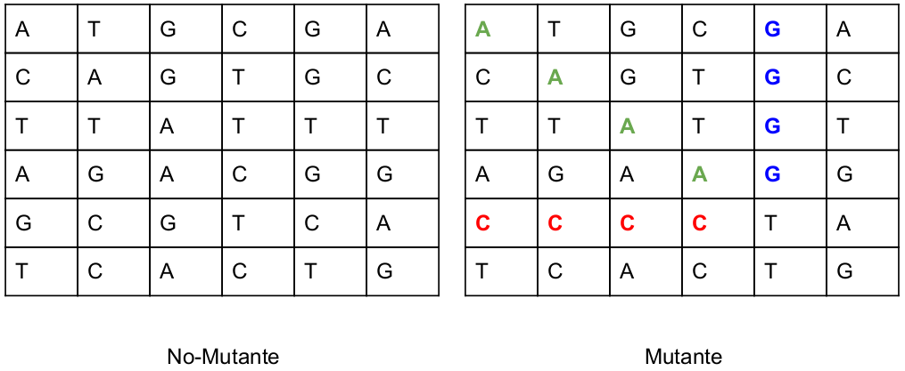

# Mutants Recruiter - Reclutador de Mutantes
Sistema para determinar si un ADN es mutante o no.

# Descripción
Magneto quiere reclutar la mayor cantidad de mutantes para poder luchar contra los X-Men.

Te ha contratado a ti para que desarrolles un proyecto que detecte si un
humano es mutante basándose en su secuencia de ADN.

Para eso te ha pedido crear un programa con un método o función con la siguiente firma (En alguno de los siguiente lenguajes: Java / Golang / C-C++ / Javascript (node) / Python / Ruby):
```java
boolean isMutant(String[] dna); // Ejemplo Java
```

En donde recibirás como parámetro un array de Strings que representan cada fila de una tabla de (NxN) con la secuencia del ADN. Las letras de los Strings solo pueden ser: (A,T,C,G), las cuales representa cada base nitrogenada del ADN.



Sabrás si un humano es mutante, si encuentras **más de una secuencia de cuatro letras iguales​**, de forma oblicua, horizontal o vertical.

**Ejemplo (Caso mutante)**:
```java
String[] dna = {"ATGCGA","CAGTGC","TTATGT","AGAAGG","CCCCTA","TCACTG"};
```
En este caso el llamado a la función isMutant(dna) devuelve "true".

Desarrolla el algoritmo de la manera más eficiente posible.

## Desafíos:
### Nivel 1:
Programa (en cualquier lenguaje de programación) que cumpla con el método pedido por Magneto.

### Nivel 2:
Crear una API REST, hostear esa API en un cloud computing libre (Google App Engine, Amazon AWS, etc), crear el servicio "/mutant/" en donde se pueda detectar si un humano es mutante enviando la secuencia de ADN mediante un HTTP POST con un Json el cual tenga el siguiente formato:
```json
POST → /mutant/
{
  "dna":["ATGCGA","CAGTGC","TTATGT","AGAAGG","CCCCTA","TCACTG"]
}
```
En caso de verificar un mutante, debería devolver un HTTP 200-OK, en caso contrario un 403-Forbidden

### Nivel 3:
Anexar una base de datos, la cual guarde los ADN’s verificados con la API.
Solo 1 registro por ADN.  
Exponer un servicio extra "/stats" que devuelva un Json con las estadísticas de las verificaciones de ADN:
```json
{"count_mutant_dna":40, "count_human_dna":100, "ratio":0.4}
```
Tener en cuenta que la API puede recibir fluctuaciones agresivas de tráfico (Entre 100 y 1 millón de peticiones por segundo).

Test-Automáticos, Code coverage > 80%.

## Entregar:
* Código Fuente (Para Nivel 2 y 3: En repositorio github).
* Instrucciones de cómo ejecutar el programa o la API. (Para Nivel 2 y 3: En README de github).
* URL de la API (Nivel 2 y 3).

# Instalación de dependencias para desarrollo
* [Node](https://nodejs.org/es/download/)
* [Docker](https://www.docker.com/get-started) (Si se desea utilizar contenedores)
* [Docker Compose](https://docs.docker.com/compose/install/) (Si se desea utilizar contenedores)
* [MongoDB](https://docs.mongodb.com/manual/installation/)  (Si no se desea utilizar contenedores)

# Configuracion
- Se debe configurar las variables de entorno para desarrollo, para eso, se deberá crear el archivo `.env` en el directorio raiz tomando como ejemplo el archivo `.envExample`.
- Existe un archivo de configuración llamado `app.config.ts` que es para setear cómo se quiere que la aplicación funciona en base a unos parámetros de configuración.

# Ejecución en desarrollo
- En ruta raíz del proyecto:
  ```bash
  npm i
  ```
- [Contenedor] Compilar el proyecto e iniciar el ambiente sin ver outputs:
  ```bash
  docker-compose up --build -d
  ```
- [Contenedor] Compilar el proyecto e iniciar el ambiente viendo outputs:
  ```bash
  docker-compose up --build
  ```
- [Sin Contendor] Ejecutar comando para inciar aplicacion para desarrollo:
  ```bash
  npm run start:dev
  ```

Éste levantará dos instancias, la de la aplicación propiamente dicha y la de base de datos que se encuentre configurada en el archivo `.env`. Hoy el desarrollo sólo tiene Mongoose

# Servidor
La aplicación fue hosteada en heroku. La URL para acceder a las apis es:  
https://mutants-recruiter.herokuapp.com

# APIS
## Obtención de estadísticas:
* Metodo: GET
* Endpoint: /
* Parámetros: (Ninguno)
* Respuesta:
```json
{
  "isOnline": true
}
```

## Guardado de ADN:
* Metodo: POST
* Endpoint: /mutant/
* Parámetros:
```json
{
  "dna": [string] Array de strings con la información de ADN
}
```
* Respuestas:
  * 200-OK: Si el ADN es Mutante.
  * 403-Forbidden: Si el ADN no es Mutante.

## Obtención de estadísticas:
* Metodo: GET
* Endpoint: /stats
* Parámetros: (Ninguno)
* Respuesta:
```json
{
  "count_mutant_dna": 1,
  "count_human_dna": 2,
  "ratio": 0.5
}
```